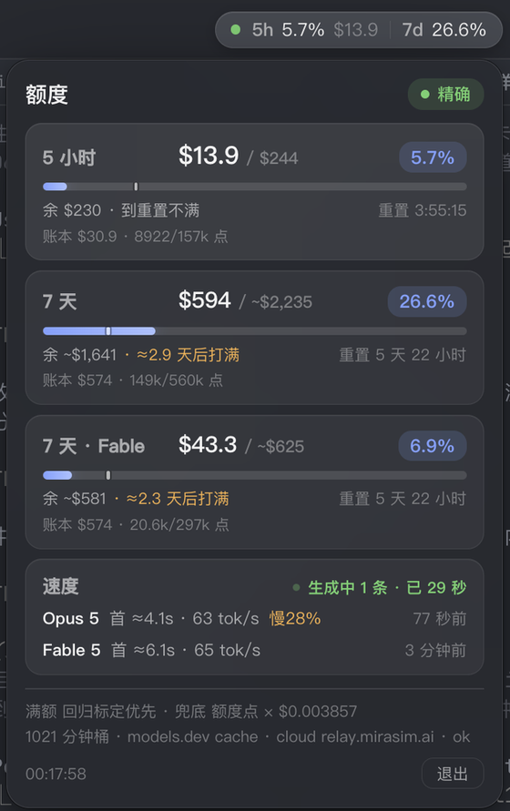

<h1 align="center">MiraQuota</h1>

<p align="center">
嵌入 <b>Mirasim 桌面客户端</b>界面的额度监控控件。读取 5 小时、7 天与 Fable 档位三个额度窗口，<br>
折算成美元并外推打满时刻。经 CDP 注入渲染进程，<b>不修改 Mirasim 的任何文件</b>，客户端升级后仍可使用。
</p>

<p align="center">


</p>

<p align="center"><sub>
An unofficial widget injected into the Mirasim desktop client via CDP, no Mirasim file modified,
turning its quota windows into a dollar-denominated view. Widget and data contract are platform-neutral;
the provider is implemented for macOS (full) and Node (portable subset). Not affiliated with Mirasim or Anthropic.
Documentation is in Chinese.
</sub></p>

<p align="center">

</p>

<p align="center">
<sub>实际界面截图。胶囊位于 Mirasim 标题栏右侧的空白段，最右三个控件为 Mirasim 自带。<br>
位置由命中测试实时计算，不使用固定坐标，窗口缩放或宿主布局变化后跟随调整。</sub>
</p>

## 概述

MiraQuota 由三部分组成。

- **控件**（`widget/miraquota-widget.js`）：纯 JavaScript 与 Shadow DOM，无外部依赖，负责全部界面。
- **常驻进程**（macOS 主实现，Swift）：聚合各数据源，完成美元折算、满额标定与速度估计，经回环 HTTP 向控件供数，并执行 CDP 注入。附带可从 Dock 打开的主窗口、菜单栏备用显示与 LaunchAgent 自启。
- **provider-node/**：常驻进程的 Node 22+ 跨平台参考实现，单文件、零依赖。覆盖额度点数、百分比、重置倒计时与均速游标。

```
Mirasim 本地接口   /v1/limits 额度点 · mirachannel 帧百分比   ┐
本机账本           Claude transcript · Mirasim 网关记录        ┼→ 常驻进程：折算、标定、外推 → 127.0.0.1:4988/quota.json → 控件 · 菜单栏 · 主窗口
诊断事件流         在途请求 · 请求时长                         ┘
```

<table>
<tr>
<td width="45%" valign="top">

</td>
<td valign="top">

点击胶囊展开面板，每个额度窗口一张卡。主行金额、进度条与百分比使用同一分母。

<ul>
<li><b>$13.9 / $244</b>：已用金额与当前窗口满额。已用金额 = 满额 × 用量百分比</li>
<li><b>进度条上的竖线</b>：均速游标。用量条越过它，表示消耗快于平均速度</li>
<li><b>账本 $30.9 · 8922/157k 点</b>：副行。前者是本机账本按 Anthropic 价目记账的支出，后者是原始额度点数</li>
<li><b>≈2.9 天后打满</b>：按最近 1 小时的点增速外推。到重置时仍不会打满，显示「到重置不满」。7d 的外推分两段，Fable 子窗口到顶后只计其余模型的增速</li>
<li><b>速度卡</b>：出字速度与首 token 等待的回归估计。有请求在途时标「生成中」</li>
<li><b>右上角的「精确」</b>：数据通道级别，共五级，见<a href="#数据降级">数据降级</a></li>
<li><b>底部两行</b>：满额来源、额度点单价、账本桶数、relay 线路状态</li>
</ul>

Mirasim 未以调试端口启动时注入通道不可用，同一份数据改由 macOS 菜单栏显示。控件正常工作时菜单栏图标隐藏。菜单栏是备用显示面。

</td>
</tr>
</table>

主行与账本行使用同一价目。主行是标定满额乘以上游百分比，账本行是本机逐笔记账。两者通常相差几个百分点，
差额来自标定滞后与网关 token 回填。Mirasim 官方每点美元口径的满额只在 `--doctor` 中输出作对照，见[满额标定](#满额标定)。

## 快速开始

```bash
git clone https://github.com/Heartcoolman/MiraQuota.git && cd MiraQuota

./scripts/install.sh                        # macOS：构建、装到 ~/Applications、注册登录自启
node provider-node/miraquota-provider.mjs   # Windows / Linux：跨平台参考 provider

./scripts/mirasim-debug.sh                  # 让 Mirasim 带调试端口重启，控件随后出现
```

## 目录

[系统要求](#系统要求) · [边界与免责](#边界与免责) · [安装](#安装) · [客户端内控件](#客户端内控件cdp-注入) ·
[数据来源](#数据来源) · [满额标定](#满额标定) · [速度与首 token 估计](#速度与首-token-估计) ·
[数据降级](#数据降级) · [命令行与故障排除](#命令行与故障排除) · [已知限制](#已知限制) ·
[资源占用](#资源占用) · [状态文件](#状态文件)

相关文档：[架构与移植契约](docs/ARCHITECTURE.md) · [跨平台参考 provider](provider-node/) · [0.2 规划记录](docs/PLAN-0.2.md)

## 系统要求

| 项 | 要求 |
|---|---|
| 宿主 | Mirasim 桌面版在本机运行，且以 `--remote-debugging-port` 启动（`scripts/mirasim-debug.sh` 或 `install.sh` 生成的启动器均可）。不带该参数时控件不出现，只有菜单栏可用 |
| Mirasim 版本 | `/v1/limits` 端点在 v0.0.220 上验证可用。现行版本需要会话入口：0.0.273 起为 base URL 里的随机路径前缀，此前为会话令牌，均取自会话进程环境，见「数据来源」。更早版本没有该端点，程序退回 relay 帧的百分比 |
| 操作系统 | 完整版 provider 需要 macOS 14 或更新，Apple Silicon 与 Intel 均可，在本机构建本机架构。Windows / Linux 使用 [provider-node/](provider-node/)，需要 Node 22+，无需构建 |
| 构建环境 | 完整 Xcode 16 或更新（Swift 6 工具链）。只装 Command Line Tools 无法编译，SwiftUI 的宏插件不在其中。`bundle.sh` 依次探测 `DEVELOPER_DIR`、`xcode-select -p`、`/Applications/Xcode*.app`，找不到完整 Xcode 时报错退出 |
| 美元口径 | 满额与已用金额由账本标定折算。账本按 Anthropic 公开价目记账，来源是 `~/.claude/projects/*/*.jsonl`（Claude Code）与 `~/.mirasim/insights/usage-*.ndjson`（Mirasim 网关，含 OpenAI Codex）。两处均为空时，点数与百分比正常显示，美元金额与单价缺失 |

本项目不提供预编译包。未经开发者签名的下载包会被 Gatekeeper 隔离，需手动移除隔离属性才能运行；
本地构建由 `bundle.sh` 做 ad-hoc 签名，没有这个问题。安装路径只有一条：克隆仓库后自行构建。

控件与其数据契约（回环 HTTP 上的 `quota.json`）不依赖操作系统。绑定 macOS 的是常驻进程中的三处实现：
菜单栏界面（AppKit/SwiftUI）、LaunchAgent 自启、基于 `ps` 与 `lsof` 的端口发现。在其他平台复用时，
按同一契约实现 provider。仓库内的 [provider-node/](provider-node/) 是参考实现，覆盖额度点数、百分比、重置倒计时与均速游标；
美元折算与速度卡需要解析本机账本，未包含在内。契约细节见 [docs/ARCHITECTURE.md](docs/ARCHITECTURE.md)。

Windows 上另有一条路线：[chiakinanam1/mirasim-quota-widget](https://github.com/chiakinanam1/mirasim-quota-widget)
向 payload 目录的 `index.html` 注入。该路线在本机无效。Mirasim 主进程加载的是应用包内的 `app.asar`，
`~/.mirasim/app/<版本>` 下的 payload 未被加载。

## 边界与免责

- 本项目非官方，与 Mirasim、Anthropic 均无关联，不代表任何一方。
- 读取的是 Mirasim 的**本地未公开接口**：路由端口的 `/v1/limits`，以及 `mirachannel` 的 WebSocket 帧。
  这些接口可能随版本更新失效。失效时按五级阶梯逐级降级，并在面板上标明当前级别，不显示未经标注的数值。
- 不接触凭证，不发起对外网络请求，不写入 Mirasim 的任何文件。只读取本机回环端口与本机账本文件。
- 控件依赖 CDP 注入。调试端口开启期间，本机任何进程都能在 Mirasim 的渲染进程中执行 JavaScript。
  端口只绑定回环地址，但应用的进程隔离因此下降。不接受此代价时不启用控件，菜单栏不受影响。
- 美元数字是基于本机账本的估算值，不是账单。长上下文溢价未建模；上游对 Fable 按价目 2 倍扣点，
  美元与额度点之间没有固定汇率。据此做用量决策前，请先阅读「已知限制」。
- 以 MIT 许可发布，不提供任何担保。

## 安装

```bash
./scripts/install.sh      # 构建、装到 ~/Applications 并注册 LaunchAgent
./scripts/uninstall.sh    # 卸载；加 --purge 一并删除标定数据
```

`install.sh` 把应用拷贝进 `~/Applications`，自启项指向该副本。安装后移动或删除仓库目录不影响运行。

安装后随登录自动启动。登录启动带 `--background` 参数，只常驻采集，不开窗口，不占 Dock。
进程崩溃由 launchd 拉起。从面板或窗口点「退出」属于正常退出，保持退出状态到下次登录。
首次安装后 macOS 会弹出一则「App 后台活动」通知。构建依赖完整版 Xcode，见「系统要求」。

菜单栏图标不出现等运行问题见[命令行与故障排除](#命令行与故障排除)。

### 主窗口

运行 `open -a MiraQuota`，或在启动台点图标。首次打开后可在 Dock 图标上右键，选「选项」中的「在 Dock 中保留」。
常驻实例已在运行时，再次打开不会另起一份采集：新进程拿不到实例锁，经回环接口的 `POST /open`
（与 `/quit` 共用令牌）把开窗请求转交给常驻实例，然后退出。

窗口分四页，数据与弹层、客户端控件同源。

| 页 | 内容 |
| --- | --- |
| 额度 | 通道级别与采集时刻、各窗口完整读数、满额与账本口径 |
| 速度 | 按模型的出字速度与首 token，按会话分行（需要逐请求实测样本），以及数字出处 |
| 自检 | `--doctor` 的同一套检查，分区呈现，结论可选中拷贝 |
| 关于 | 版本、数据路径与访达入口、降级阶梯、退出 |

关闭窗口不退出应用。本体是常驻采集，菜单栏项与客户端控件继续工作。

## 客户端内控件（CDP 注入）

这是本项目的主形态。控件与数据侧之间有两份契约：回环 HTTP 上的 `quota.json`，以及 CDP 注入流程。
两份契约写在 [docs/ARCHITECTURE.md](docs/ARCHITECTURE.md)，换平台重写 provider 时按其实现。

```bash
./scripts/mirasim-debug.sh          # 退出并以 --remote-debugging-port=9333 重开 Mirasim
```

之后 MiraQuota 每 10 秒巡检一次 CDP 端点，稳定后退避到 30 秒，把控件脚本送进渲染进程：
`Page.addScriptToEvaluateOnNewDocument` 覆盖此后每次导航，`Runtime.evaluate` 处理当前页面。
控件出现在 Mirasim 界面右上区域。

### 落位与吸附

控件支持拖动移位，松手时落盘，位置限制在视口内。点胶囊或按 Esc 开合。展开层下方装不下时翻到上方。
层内文字可选中复制。「退出」需连续点击两次确认。拖到标题栏空位时自动吸附。

吸附位定义为标题栏上不与宿主控件重叠的最右一段空白。Mirasim 的标题栏右侧有波形、云端用量、分支、复制等自带控件，
直接贴右上角会与之重叠，所以落位通过命中测试完成：在标题栏带上从右向左扫描，取第一段能容纳胶囊的空白。
本机实测空白段为 x 415–875，胶囊落在 695–877，与宿主控件间隔 8px。竖向位置按宿主底色的连续区段居中，
而不是 header 元素的标称高度：Mirasim 的 header 元素高 28px，其下方还有约 6px 同色区域，视觉上是一条约 34px 的深色带，
按 28px 居中会让胶囊贴着窗口上沿。落位时自顶向下逐像素比对背景色，取同色连续段作为带高。

命中吸附的条件有两项：竖向贴着标题栏（±16px）；横向在吸附位左右 140px 内，或该落位会压住宿主控件。
压住宿主控件的位置不应停留。吸附后只保存一个标志位，坐标每轮重新计算，
窗口缩放、标签增减、宿主控件出现或收起时落位跟随调整。拖离吸附位即解除，之后按保存的坐标落位。

### 主题与渲染

主题按 `data-theme` 属性、宿主背景亮度、系统偏好的顺序判定。只看系统偏好会把浅色控件贴到深色的 Mirasim 界面上，
所以宿主背景亮度参与判定。系统开启「减弱动态效果」时关闭全部过渡与脉冲动画。
控件 DOM 只构建一次，后续更新只改文本与宽度。进度条的宽度过渡因此有效，hover 状态与文字选区不被周期刷新打断。

### 数据通道

控件不读写文件。常驻进程在 `http://127.0.0.1:4988/quota.json` 提供算好的 JSON，
4988 被占用时向后顺延至 4995，只绑回环，只读。控件每 5 秒 `fetch` 一次。
失联时控件在该端口区间内重新探测，持久注入脚本中记录的旧端口不会造成永久失联。

另有 `POST /quit` 用于退出，请求必须携带 `X-MiraQuota-Token` 头。令牌在 `~/.miraquota/feed.token`，权限 0600，首启生成。
校验是必要的：回环端口上的任何网页都能发出请求，GET 与简单 POST 经浏览器不经预检直接送达，
若无令牌校验，任何被访问的网页都能关闭本应用。渲染进程读不到 `~/.claude/projects` 与网关账本，
美元与速度数据只能经此通道传入。

### 为什么走 CDP 而不是改文件

| 路径 | 结论 |
|---|---|
| 注入 `~/.mirasim/app/<版本>/{renderer,web}/index.html` | 无效。主进程实际加载应用包内的 `app.asar`，payload 目录未被使用 |
| 直接修改 `app.asar` | Electron fuse `EnableEmbeddedAsarIntegrityValidation` 未启用，修改不会被完整性校验拦截，但会破坏应用签名，且每次升级都被覆盖 |
| CDP 注入（采用） | 不接触 Mirasim 的文件，升级不失效。代价是启动参数需携带调试端口 |

渲染进程的 CSP 为 `script-src 'self'`，普通 `<script>` 标签加载不了外部脚本。经 CDP 执行的代码不受 CSP 约束，
`connect-src` 放行 `http://127.0.0.1:*` 与 `ws://127.0.0.1:*`，控件因此能回连取数。

安全代价的完整说明见[边界与免责](#边界与免责)：调试端口开启期间，本机任何进程都能在 Mirasim 渲染进程中执行 JS。
不接受此代价时不运行 `mirasim-debug.sh`。控件不出现，菜单栏图标继续工作。

## 数据来源

| 数据 | 来源 | 说明 |
|---|---|---|
| 已用额度点、总额度、重置时刻 | `<会话 ANTHROPIC_BASE_URL>/v1/limits` | 原始值，`used` 带小数位。需要会话入口（路径前缀或令牌） |
| 额度百分比、重置时刻（退路） | `ws://127.0.0.1:<port>/mirachannel/ws` 的 `getRelay` 帧 | 与 Mirasim 界面同源，分辨率 0.1% |
| 等价支出 | `~/.claude/projects/*/*.jsonl` | Claude Code 全量 token，含 cache 分量与 model |
| 等价支出（网关） | `~/.mirasim/insights/usage-*.ndjson` | 补充不写 Claude transcript 的请求，包括 OpenAI Codex 的 `openai-responses` |
| 价目表 | `~/.mirasim/models-dev-cache.json` | 缺失时回退到内置表 |
| 请求时长 | `~/.mirasim/insights/usage-*.ndjson` 的 `durationMs` | 单次请求总耗时，用于速度回归 |
| 在途请求 | `~/.mirasim/diag/ev-*.ndjson` 的 `model.begin` / `model.end` | 请求发出即落盘，用于「生成中」标记 |
| 实测首字节 | `~/.mirasim/analytics/events-*.ndjson` 的 `turn.finish.props.ttfbMs` | 只覆盖图形界面发起的对话，作量级对照 |

成本账本识别 Anthropic 的 Claude 请求，以及 OpenAI 的 `openai-responses` / `openai-chat` 网关记录。
OpenAI Codex 的 token、耗时和模型名直接取网关记录，没有对应 Claude transcript 时这部分支出仍被计入。
OpenAI 的美元数是公开 API 价目下的等价金额，不代表 ChatGPT/Codex 订阅账单中的实际扣款。

`/v1/limits` 挂载在 Mirasim 为每个会话分配的回环端口上，即 Claude Code 通过 `ANTHROPIC_BASE_URL` 使用的端口。
返回 `windows[].{name, used, budget, reset_at}` 及 `suspended` / `unmetered` / `degraded` 三个账号状态位。
该端点未公开文档化，v0.0.220 实测可用。路由端口通过枚举持有 mirachannel 端口的那个进程的回环监听得出。
限定同一进程，是为了在同时运行开发实例时不读到另一账号的额度。该做法来自
[chiakinanam1/mirasim-quota-widget](https://github.com/chiakinanam1/mirasim-quota-widget)。

端点的鉴权方式分三个阶段。早期版本对本机连接免认证。0.0.235–0.0.272 按普通 API 请求鉴权，缺 `x-api-key` 返回 401。
0.0.273 起按 URL 路径放行：`ANTHROPIC_BASE_URL` 形如 `http://127.0.0.1:<端口>/<随机前缀>`，
裸路径无论带不带令牌都返回 401，带前缀则不检查令牌，前缀与端口一一绑定。前缀与令牌都不落盘，
只存在于 Mirasim 拉起的会话进程环境里。程序直接取该进程的 `ANTHROPIC_BASE_URL` 整段作 base，
`ANTHROPIC_AUTH_TOKEN` 作令牌，按端口配对，三个阶段都能通过。
枚举用 `ps eww -U <当前用户>`。不给用户选择符时只列同用户且同控制终端的进程，LaunchAgent 没有控制终端，结果为空。
没有活跃会话时取不到入口，该级降级为帧口径。

远端同名端点不可用：`https://relay.mirasim.ai/v1/limits` 要求 `device.privateKey` 的签名头，
只凭 `setting.json` 中的 auth token 返回 401。网关账本中的 `anthropic-ratelimit-unified-7d-utilization` 响应头
只存在于 2026-08-09 之前的旧 relay 记录，现行 `relay.mirasim.ai` 不再透传，也从未透传过 `5h`。
额度百分比本身不落盘，只存在于 Mirasim 进程内存。因此本项目只依赖 Mirasim 的本地接口：
不接触凭证、不发起网络请求、不写入 Mirasim 文件。对 Mirasim 而言，它是一个只读的本地 WebSocket 客户端，
不会导致 Mirasim 报错或无法启动。

## 满额标定

### 主路径

`/v1/limits` 直接给出已用与总额的额度点数，百分比等于 `used / budget`，不需要反推。
美元由标定给出：满额 = 每点美元 × 预算点，主行 = 满额 × 百分比。

### 价目口径

账本按 Anthropic 公开价目记账，与 Mirasim「流量监控」页的估算成本同口径。标定满额与主行由账本推出，也是这个口径。

上游扣点另有倍率。以网关账本对 `7d_fable` 点序列做 10 分钟分箱回归（2026-09-03，247 次调用，R² 0.998），
Fable 5.1 的输入、输出、缓存读、缓存写四类均按价目 2 倍扣点；Opus 5 在全部截点为 195–214 点/美元，按价目扣点。
每点美元因此随 Fable 占比漂移，纯 Fable 时段约为纯 Opus 时段的一半。标定按近期混比给出当前值。

### 官方口径

Mirasim 公布 MAX 40X 的 7 天额度为 $5600，同一账号 `/v1/limits` 的 7d 预算点为 560000，即 1 点 = $0.01。
`paid` 为 false 的内测账号额度减半，折成每点 $0.005。该口径下本机满额为 5h $784、7d $2800、7d_fable $1484。
这是 Mirasim 扣点单位的美元值，与账本不同口径，不进面板。`--doctor` 的「官方口径 / 官方满额」两行并列输出官方值与标定值。

7d_fable 的预算点为 7d 的 53%，对应 Anthropic 对 Fable 不超过周额度一半的规则，由端点直接给出。

### 卡面

面板上 `$22.0 / $536` 的分母是该窗口的标定满额，`4.1%` 是上游点数比值，分子 = 分母 × 百分比。账本支出另列一行。

「余」在 7d 上按分段单价折算：Fable 子窗口还能消耗的点按 Fable 单价，其余点按其它模型单价。
Fable 到顶后剩余点只能由 Opus 使用，每点价值约翻倍，单一混合单价会把余额低估近半。
7d 的主行加余额因此不等于满额。`--once` 的「余额分段」行给出两段的点数与单价。

### 标定口径一：点数

满额 = 一段时间内的支出 ÷ 同期点数增量 × 预算点数。点数是绝对量，跨预算点变更仍可比，分辨率高于百分比。
`/v1/limits` 可读时走这一路。乘上去的预算点必须取当前值，不能取样本自带的值：每点美元不受改档影响，
预算点受影响。2026-08-26 23:16 的 7 天窗口滚动把 5h 预算点由 156800 降到 39200，沿用旧样本的预算点会把满额抬高四倍。

### 标定口径二：百分比

端点取不到时（旧版 Mirasim 无该端点）退回 relay 帧，满额 = 一段时间内的支出 ÷ 同期百分比增量 × 100。
该口径不能跨预算点变更使用。2026-08-24 17:34，5h 预算点由约 42525 扩到 156800，`used` 不变而百分比直落到 27%，
变更前的 1 个百分点值 425 点，变更后值 1568 点，混算会把满额压低三成（$352 对应有的 $536）。
断点判据是重置时刻不变却出现 5 个百分点以上的回落。窗口正常重置时 `reset_at` 必然变化，命中判据后弃用断点之前的全部样本。

### 兜底：全局单价 × 预算点数

两个口径都未收敛时才用，并标注低置信。单价 = 窗口内账本支出 ÷ 已用点数，取已用点数最多的窗口反推，各窗口共用同一取值。
该窗口总是 7d，`单价 × 7d 预算点` 与 7d 的百分比标定是同一个式子，两者吻合不构成互校。
挪到别的窗口有偏差：5h 差 8.1%，7d_fable 差 10.1%。来源是每点美元随时段的模型混比与缓存读占比漂移，
实测范围 $0.00235–0.00502。各窗口的点是同一单位，Δ5h点/Δ7d点 在 1.0 附近。
`--doctor` 并列输出两者，非同源窗口分歧超过 30% 时告警。

### 配对逻辑

两个标定口径共用同一套配对逻辑。支出与增量两侧都要挂起，等对面出现非零变化时才计为一次完整观测。

- 只挂起支出（增量不动时累积美元）：逐对丢弃零增量样本，满额被系统性低估约 60%。
- 只挂起增量（支出未落账时累积增量）：账本按请求完成时刻计费，有请求在途时增量先涨、支出后落账，
  丢弃这部分增量等于少算分母。5h 窗口上有 91/270 步属此情形，合计 12.7 个百分点，满额被高估约三成
  （$261 对整段口径的 $202）。这 91 步在区间内全部有本机请求在途，并发中位数 2 条，支出在其后中位 1 分钟落账，
  判定为归属滞后。挂起超过 10 分钟仍无对应支出的样本丢弃。

并行请求会放大第二种误差。按同期平均并发分组验证：只挂起支出时，低并发段推出 $302，高并发段推出 $211；
两侧都挂起后分别为 $207 与 $204，并发依赖消失。

### 冷启动、置信与自检

冷启动时导入 relay 帧自带的百分比环形缓冲，约 120 点、76 分钟，不从零等待。
逐对隐含单价两端各 10% 的样本被裁掉，以剔除上游重算配额造成的增量跳变。
置信度按标定覆盖的跨度与观测数判定，点数口径的跨度折成百分比后与百分比口径同尺。
未达高置信时数值前加 `~`。两个口径都可用时取置信更高的一个，同级时取点数口径。

标定结果可离线自检：强制离线后，本机支出 ÷ 标定满额得到的百分比应接近 relay 实测值。
修正后为 $20.21 / $206 = 9.8%，与同刻实测的 9.8% 一致；修正前的 $261 给出 7.7%。

### 换账号

判据是 relay 帧里的 `login.userId`，落盘在 `account.json`。换账号会同时换套餐，窗口重置时刻随之变化，
与正常重置无法区分，前述同 `resetAt` 大幅回落的断点判据抓不到这类断点，需要另设身份判据。
2026-08-26 观测到三个窗口的预算点同时变为原先的四分之一：5h 39200 对 156800、7d 140000 对 560000、7d_fable 74200 对 296800。

判据不取同帧的 `tokenTail`，缺 `login` 时也不退到它。`tokenTail` 是 relay 令牌的尾号，令牌有效期约 1 小时，到期即换，
帧内 `login.exp` 与本机落盘的切换时刻相差 3538 秒。以它为判据，每轮换一次就误判一次换账号，
速度样本与百分比标定样本被逐小时清空。48 小时内 6445 条实测样本只有 11 条越过下界，首 token 回归因样本不足而无输出。

把它留作退路同样不可行。部分帧不带 `login`，两个命名空间之间来回切换时，尾号一换就误记一次切换时刻，
样本下界被抬到当下，账本尾部 1522 行里 1450 行被排除在外，速度卡定格在误判时刻不再前进。
因此缺 `login.userId` 的帧不参与账号判定，状态沿用上一次，由自检报出。
落盘取值带来源前缀 `u:`，旧盘面里的尾号取值（`t:` 或无前缀）按判据变更处理。状态带版本号，
1 及以下的切换时刻全部撤销：它们可能来自轮换误判，保留会继续压制本可用的样本。

标识变化时的处理：百分比样本全部弃用（1 个百分点值多少点已变，跨账号不可比），随后由帧自带的环形缓冲重新播种；
点数样本保留（每点美元是模型价目的属性，跨账号可比），但满额所乘的预算点只认当前值。
`/v1/limits` 可读时取自当帧；不可读且最后一条点数样本早于切换时刻时不给数，退到支出 ÷ 百分比的兜底，
以免把旧套餐的预算点当成新的。速度样本一并设界，见下节。

### 换套餐

同账号内升降档位时 `userId` 不变，换账号的判据抓不到，而预算点与上游服务质量都会变。
档位取自帧内 `login.plan`，实测取值 plus / max。变更按区间记入 `account.json` 的 `plans`，各档位的样本各自保留：
百分比样本带采样当时的档位标签，估算只取当前档位的；速度样本按时刻归入档位区间，区间之外的不参与本档位的估计。
切回原档位时复用其历史样本，不需要重新积累。点数样本不分档位：点是绝对量，每点美元跨档位可比，
只有满额所乘的预算点须取当前值。

### 模型档位窗口

`/v1/limits` 的窗口可带 `model_scoped`，实测为 `7d_fable`，只累计特定模型档位的用量。
这类窗口的等价支出必须按同一档位过滤。本机实测该窗口用量为 0 点，同窗口全机支出 $26.13，
不过滤会把全机支出挂到零用量的窗口上。档位组名取窗口名下划线之后的部分，模型名含该子串即归入。
账本为此另开一路分桶，键为「组名 | unix 分钟」。桶只存金额、不留模型，该组从声明时刻起累积，
窗口起点早于声明时刻时其支出偏低，自检的「档位窗口」一行据此提示。全局单价的反推排除这类窗口：
它们的点数与全机支出不同口径，混入会把每点美元压低。

## 速度与首 token 估计

本机没有任何文件记录单次请求的首 token 时刻。transcript 只有消息落盘时间，网关账本只有请求总时长。
同一模型上，总时长与输出量近似线性：

```
时长 ≈ 首 token 等待 + 输出量 ÷ 出字速度
```

对窗口内请求做回归，斜率给出字速度，截距给首 token 等待。首 token 因此标注 `≈`。

### 采样与平滑

- 出字速度只取最近 5 次请求，按 token 数加权，显示值做一阶平滑，系数 0.35。与上次显示值相差超过 60% 时判定为工况切换，
  直接跳变，不再平滑。首 token 取 48 小时内全部样本的回归截距。两者时间尺度不同是设计选择：
  首 token 无法逐次测量，样本少时不足以支撑回归；出字速度要跟随近期工况，取整窗中位数会被几百条旧样本稀释，
  新增一条对中位数的影响不到 1%。
- 加权而非取中位数。几十 token 的短请求里首 token 占了大部分时长，逐条比值噪声大，
  同一段时间内逐条落在 32–101 tok/s。按 token 加权后长请求占主导，新样本能即时推动结果。
- 新鲜度：行尾显示最近一次请求距今多久。出字速度是逐次请求的量，请求完成并落账后才更新，无新请求时数字不变。

### 在途检测

请求尚在流式传输、未完成时，速度卡顶部显示脉冲点与「生成中 N 条 · 正在生成：已 M 秒」。
数据来自诊断事件流 `~/.mirasim/diag/ev-*.ndjson`：`model.begin` 在请求发出瞬间落盘，`model.end` 在完成时落盘，
按 `callId` 配对，未闭合的即为在途。Claude 使用 `/v1/messages`，OpenAI Codex 使用 `/backend-api/codex/responses`，
直连 OpenAI 的 `/v1/responses` 与 `/v1/chat/completions` 也被识别，共用这条通道。
中断的请求不发 `end`，在途超过 10 分钟判定为已弃。已闭合请求的 95 分位时长 46 秒，最长 383 秒。
有请求在途时控件轮询间隔降至 2 秒，「已 M 秒」逐秒走动。请求完成后，出字速度随下一次账本落账更新。
流式过程中本机没有可用的 token 计数，能实时看到的是在生成、已多久；出字速度仍是完成后计算的量。

### 偏离提示

「快 / 慢 x%」提示的闸门条件：样本 ≥3，幅度进 25% 出 18%，当前值不超过基准的三倍。
阈值分进出两档，避免在边界上反复闪烁。三倍上限用于挡掉样本构成的突变，曾出现 150 tok/s 对基准 79 的情形。

### 显示名与分模型

账本中是 `claude-opus-5`、`claude-opus-4-8`、`claude-haiku-4-5-20251001`、`gpt-5.6-sol` 这类原始模型名。
界面显示为 `Opus 5`、`Opus 4.8`、`Haiku 4.5`：去掉 `claude-` 前缀与快照日期，族名首字母大写，版本号用点连接。
版本段不是纯数字时（如 `gpt-5.6-sol`）原样保留。
混合模型的统计偏移明显：全模型合计 1.4s / 60 tok/s，只取 opus-5 为 4.5s / 81 tok/s。因此按模型分行，最多三行。

### 回归方法

按输出量排序后取跨半程配对的斜率中位数，即确定性的 Theil–Sen 变体，对重试、网络抖动等离群时长不敏感。
输出量相同的样本按时长再排一次序。否则并列样本的配对顺序随排序实现变化，中位数会漂移数个百分点。

### 门槛与筛选

- 回归要求同模型 ≥12 条样本才给出首 token。最近样本不足 2 条，或最近一次请求超过 2 小时时不成行。
  没有首 token 时只报端到端速率（输出量除以总时长，含首字等待）。回归截距为负时同样只报速度。
- 只统计 `status == 200`、输出量 ≥32、时长 ≥200ms 的记录。账本里 token 未回填的记录约占三成，不计入。
  其时长中位数 9.0s 与入选记录的 10.2s 接近，剔除不引入方向性偏差。

### 不等回填的三方关联

账本记录落盘即时，但 token 要等 relay 回填。落盘时 `output` 为 0，回填耗时几十秒到数分钟，
且回填会原地改写历史行，同长度前缀的 md5 数秒内即变。只读账本必然滞后，甚至永久丢样本。
因此 token 与时长都改从即时来源获取，用账本记录做关联枢纽。

| 取什么 | 来源 | 关联键 |
|---|---|---|
| 关联枢纽、模型、时刻 | `insights/usage-*.ndjson`，尾部重扫 1 MB，按 `id` 去重 | — |
| 输出 token（即时） | Claude 取 `~/.claude/projects/*/*.jsonl` 的 `message.usage.output_tokens`；OpenAI Codex 直接取网关账本 | Claude：账本 `providerCallId` == transcript `requestId`；OpenAI：网关 `id` / `providerCallId` |
| 请求时长（即时） | `diag/ev-*.ndjson` 的 `model.end.durationMs` | 账本 `id` 冒号后半段 == diag `callId` |

回填后的记录中，账本 `output` 与 transcript token 逐条相等（134/159/292/987），口径一致。
尚未回填的记录账本为 0 而 transcript 已有值，这条路径把新鲜度从几十分钟压缩到几十秒。
不能对账本使用单向游标：越过的行在回填后读不到。

### 稳定性、并行与对照

- 856 条 opus-5 记录按 150 条连续分段：首 token 落在 2.3–4.6s，出字速度 73–95 tok/s，OLS R² 为 0.71–1.00。
  样本降到 20 条仍给出 3.5s / 83 tok/s。
- `durationMs` 是每条请求各自的墙上时间，重叠不改变回归结构，只带来链路争用的偏移。
  39.5% 的请求与其他请求时间重叠。按重叠程度分组：独占 540 条得 3.65s / 83.7 tok/s，有重叠 351 条得 3.08s / 76.3 tok/s，
  重度重叠 ≥3 条的 58 条得 3.21s / 75.8 tok/s。争用使出字速度降低约 9%，落在分段波动区间内，不按并发度分别展示。
- 提示浮层附上 Mirasim 自测的 `turn.finish.ttfbMs` 中位数作对照。它是整轮首字节而非单次请求，
  只覆盖图形界面发起的对话，两天共 7 条，作量级参照。

出字速度不含首字等待，高于端到端速率。三者相互校验：首 token + 输出量 ÷ 出字速度应接近观测到的时长中位数，
4.5 + 460/81 ≈ 10.2s，观测中位 9.7s。

### 换账号后的下界

上游线路随账号更换，首 token 与出字速度都可能整体平移，切换前的样本弃用。出字速度只取最近 5 次，两小时内即更替完毕；
首 token 回归与「较常态」取的是 48 小时保留期内的全部样本，不设界会让两天之内的对照混入旧账号的数据。
下界取 `account.json` 里的切换时刻，启动时即生效。样本来自磁盘上的网关账本、transcript 与分析事件，游标只在内存里，
重启会把切换前的请求重新扫回来。整轮首字节对照按事件自带的 `ts` 同样设界。切换后该卡片在第一批新请求落账前为空。

### 档位分组

换套餐不弃样本，只换过滤区间。样本按时刻归入 `account.json` 的档位区间，估计只取当前档位的区间。
整轮首字节对照是例外：它只存取值、不留时刻，无法按区间筛，变更时清空，由后续事件重新累积。
速度行另带所属的模型档位组 `modelGroup`，与 modelScoped 额度窗口对应。不属于任何档位窗口的模型该字段为空，
其用量计入通用窗口。

## 数据降级

通道不可用时按五级阶梯逐级退让，每一级都有可读输出。面板顶部的状态标签与横幅说明当前级别及数字来源。

| 级别 | 触发条件 | 数据来源 | 标记 |
|---|---|---|---|
| 精确 | 路由端口的 `/v1/limits` 可读 | 原始额度点，百分比为 `used / budget` | 绿点 |
| 实时 | 端点不可读但 relay 帧持续到达 | 帧内百分比，分辨率 0.1% | 青点 |
| 已过期 | 连接尚在但帧停更 | 最后一次实测值 | 黄点 |
| 推算 | Mirasim 未运行或不可达 | 落盘的窗口锚点滚动 + 本机账本 | 橙点，百分比前加 `≈` |
| 本地 | 从未取得过锚点 | 最近 5 小时 / 7 天的滚动窗口支出 | 灰点，无重置倒计时 |

窗口为固定窗口。只要实测过一次重置时刻，其后每个窗口的边界都能由重置时刻加整数倍窗口长度推出。
锚点落在 `~/.miraquota/anchor.json`，Mirasim 完全关闭时仍能给出估算。

5 小时窗口的边界由窗口内第一次请求锁定。零用量时段 relay 报的 resetAt 等于采集时刻加 5 小时，每次轮询都是新值：
`resetAt - capturedAt` 恒为 300 分钟，锁定后降到 238–248 分钟。未锁定的取值不触发锚点落盘，离线推算沿用最后一次锁定的边界。
离线期间跨过一个零用量窗口时，推算边界最多偏差一个窗口长度。推算值只反映本机已落账的支出，不含在途请求，偏低；
恢复实时后百分比通常跳高。

Mirasim 更新导致帧格式变化时，解析按候选键名逐个回退，常规路径落空时对帧做一次有界深搜。
嵌套层级、键名、百分比的整数或小数形式、时间戳的 ISO 或毫秒格式均不影响取值。
整数与小数优先按「已用 + 剩余」之和判定：百分数刻度下该和为 100，小数刻度下为 1，与用量高低无关。
缺 `remainingPercent` 字段时才退回量级判据（窗口与历史缓冲的全部取值落在 (0,1] 才按小数换算）。
逐值判断区分不了真实的 0.4% 与小数的 0.4。量级判据在低用量期会判错：7 天窗口滚动后整帧连同历史缓冲都落在 (0,1]，
一律 ×100 会把 0.9% 画成 90%，并把同样放大的样本写进标定。
换算后不在 0–100 的取值不显示。深搜命中额外要求数值形似百分比、时间形似未来时刻，
防止帧内同形的无关数组（如点数余额）被误认为窗口。该行为可用 `scripts/fake-mirasim.py` 复现：

```bash
python3 scripts/fake-mirasim.py renamed &   # 换嵌套、换键名、小数占比、毫秒时间戳
MiraQuota --port 4979 --once                # 仍应解析出两个窗口
python3 scripts/fake-mirasim.py garbage &   # 帧完全无法识别
MiraQuota --port 4979 --once                # 应报「协议不符」并转入推算
```

真实 Mirasim 同时运行不影响该验证。`/v1/limits` 的探测限定在持有锚点端口的那个进程上，
伪实例不持有该端点，真实实例的端点也不会应答。完全解不出来时报「协议不符」并转入推算模式。

## 命令行与故障排除

```bash
MiraQuota --doctor        # 逐项检查链路，指出断点与处置办法
MiraQuota --once          # 采集一次并打印
MiraQuota --background    # 只常驻，不开窗口、不占 Dock（LaunchAgent 用这一路）
MIRAQUOTA_DEBUG=1 ...     # 打印通道收到的原始帧
MIRAQUOTA_OFFLINE=1 ...   # 强制离线，验证降级路径是否可用
MIRAQUOTA_SPEED_SPAN=45   # 覆盖速度统计的窗口长度（秒），验证样本不足的退化分支
MIRAQUOTA_NO_LIMITS=1     # 屏蔽 /v1/limits，验证退回 relay 帧百分比那一级
MIRAQUOTA_CDP_PORT=9333   # 指定 Mirasim 的调试端口（默认试 9333、9222）
MIRAQUOTA_WIDGET=<路径>    # 指定控件脚本，开发时免去重新打包
MiraQuota --port 4970     # 指定端口，默认自动发现
```

端口发现顺序：`--port` 参数，4970，从 `ps` 解析 `server.cjs serve --port N`，逐个用 `/api/health` 校验。
连续失败后额外扫描 4970–4980。

改控件样式时不必反复重启 Mirasim：

```bash
scripts/widget-shot.sh dark          # 无头 Chrome 出图，数据取本机 4988 的真实读数
scripts/widget-shot.sh light /tmp/a.png
```

取景台 `scripts/widget-preview.html` 铺一条标题栏替身供吸附判定，经本地 http 服务加载。
`file://` 页面的源是不透明的，`localStorage` 会直接抛异常，控件退到内存态，位置与吸附都测不出。
入场动画在截图上看不出来：无头 Chrome 的虚拟时间把定时器一次跑完，画面上永远是终帧。
用 `?probe=1` 读计算样式核对：

```bash
# 输出各卡片的 animation-name / delay，以及减弱动态效果下是否归零
"/Applications/Google Chrome.app/Contents/MacOS/Google Chrome" --headless=new \
  --virtual-time-budget=3000 --dump-dom "http://127.0.0.1:<端口>/index.html?probe=1"
```

**菜单栏图标不出现**（`--doctor` 显示作业在运行，但看不到图标）：

```bash
launchctl kickstart -k gui/$(id -u)/local.miraquota
```

原因：用 `rm -rf` 加 `cp -R` 重建 app 包会使 LaunchServices 的注册过期，紧随其后启动的那次进程
虽然建出了状态栏项（`button=true visible=true`），却拿不到菜单栏位置。
`install.sh` 在末尾重启一次作业规避此问题。登录时的启动面对的是稳定的包，不受影响。

另外，`launchctl bootout` 是异步的，未等作业拆除完毕就 `bootstrap` 会以 `EIO` 失败。
不要回退到 legacy 的 `launchctl load`：那样加载的 agent 进程能运行，但同样拿不到菜单栏位置，表现为装好了却没图标。

## 已知限制

**429 不等于额度被他人占用。** 早期版本据本机 5 小时支出为 $0 时出现 429 的现象，推断额度归 relay 账号池共享。
后经点数序列核对，该现象来自扣点归属滞后：上游按请求完成时刻扣点，请求在途时点数已涨而本机账本尚未落账。
额度点归本账号独占，标定出的满额是本账号的满额。

**额度点与美元是两套单位。** `used` / `budget` 是 Mirasim 自己的计量单位，百分比由二者相除得出，与美元无关。
账本按 Anthropic 公开价目记账，与 Mirasim「流量监控」页的估算成本同口径；满额与主行由账本标定给出，同为该口径。
上游对 Fable 5.1 按价目 2 倍扣点，`--doctor` 中按官方每点美元算出的满额因此高于标定满额，Fable 用量占比越高差距越大。
单价、满额、已用金额都继承账本自身的偏差。`/v1/limits` 未公开，Mirasim 改动后可能失效，届时退回帧口径。

**绝对金额偏低，占比不受影响。** 长上下文溢价未建模，美元数字整体偏低。标定与计量共用同一张价目表，比例一致，
占比与均速结论不受该偏差影响。

**速度是回归估计，不是测量值。** 首 token 与出字速度都由时长对输出量的回归得出，不是逐次实测。
时长包含 relay 转发与网络往返，估出的首 token 高于模型自身延迟。思考 token 计入输出量，长思考会把出字速度算高。
并行请求的链路争用使重叠样本的出字速度低约 9%，卡片上的数字是两种情形的混合。

**控件依赖调试端口。** Mirasim 以普通方式启动时没有 CDP 端点，控件不出现，菜单栏图标自动显示。
Mirasim 每次重启都需携带该参数，`mirasim-debug.sh` 只作用于当次启动。

**7 天窗口需要时间收敛。** 7d 百分比短时间内变化极小，分辨率不足。5h 通常几十分钟达到高置信，7d 需要累积数天的样本。

**两个窗口可能显示相同的已用金额。** 5h 与 7d 的窗口起点由同一批请求触发时，`resetAt − 窗口长度` 得到相同起点，
已用金额相同。这是固定窗口机制的结果。

## 资源占用

心跳 5 秒一轮。一轮内的文件工作按变更检测收敛，空闲时几乎不读盘。

| 数据 | 变更检测方式 |
|---|---|
| transcript（本机 2038 个 `.jsonl`） | 目录 mtime 发现新会话，近 15 分钟活跃文件重取属性，全量枚举每 5 分钟兜底一次 |
| 网关账本、速度账本 | mtime 未变即跳过。回填会原地改写历史行，判 mtime 而非长度 |
| 诊断事件、analytics | 字节游标增量读 |

逐轮对全部会话文件取属性的旧做法约合每秒 400 次属性读取，常驻 CPU 4.5% 单核，RSS 在 61–91 MB 间往复。
收敛后同等条件下 CPU 1.7–1.8%，RSS 49–65 MB。小幅往复来自每轮 1 MB 尾读与字典重建，只在文件变化时发生。

注入器在全部页面都已带着最新控件连续三轮后，把巡检间隔从 10 秒放宽到 30 秒。任何一轮落空即回到 10 秒。

## 状态文件

| 路径 | 内容 |
|---|---|
| `~/.miraquota/ledger.json` | transcript 读取游标、分钟级成本桶、requestId 去重表、网关账本的按 id 账目，保留 8 天。带折算口径版本号，口径变更后启动时清空并从磁盘重建 |
| `~/.miraquota/calibration.json` | 百分比样本序列，保留 14 天，每窗口上限 4000 条 |
| `~/.miraquota/calibration.lock` | 标定落盘的文件锁，防止常驻实例与 `--once` 并发写时互相覆盖 |
| `~/.miraquota/anchor.json` | 最后一次实测的窗口锚点，供离线推算。未锁定的取值不覆盖已锁定边界 |
| `~/.miraquota/account.json` | 账号标识（relay 帧的 `login.userId`，带来源前缀）、最后一次切换时刻、套餐档位的变更区间 |
| `~/.miraquota/feed.token` | 本机接口 `/quit` 的令牌，0600，首启生成，跨启动稳定 |
| `~/.miraquota/instance.lock` | 单实例锁，避免两份进程互相覆盖标定样本 |
| `~/.miraquota/agent.log` | LaunchAgent 的标准错误输出 |

百分比未变化的样本不落盘。零用量时段 5h 的 resetAt 每次轮询都不同，若计入判重，
空闲一天会写入约 4300 条占位样本，把真实样本挤出 4000 条上限。过滤前后满额估计一致（$205.8 / 146 观测），
样本量由 1025 条降到 279 条。

首次建账需扫过约 1 GB transcript，耗时约 1.5 秒。此后按文件游标增量读取，每轮只解析新增行。
`requestId` 去重是必需的：fork 与 resume 会把父会话的消息复制进新文件，不去重会重复计入。
网关账本不走游标，因为行会被回填原地改写。每轮重扫尾部 1 MB，按 `id` 记账，
token 回填使金额变大时把差额补回原分钟，token 未回填的行不入账也不标记已见，留待回填后重读。
标定样本落盘前先取文件锁并与磁盘上的既有样本合并，两个实例同时写也不丢数据。
